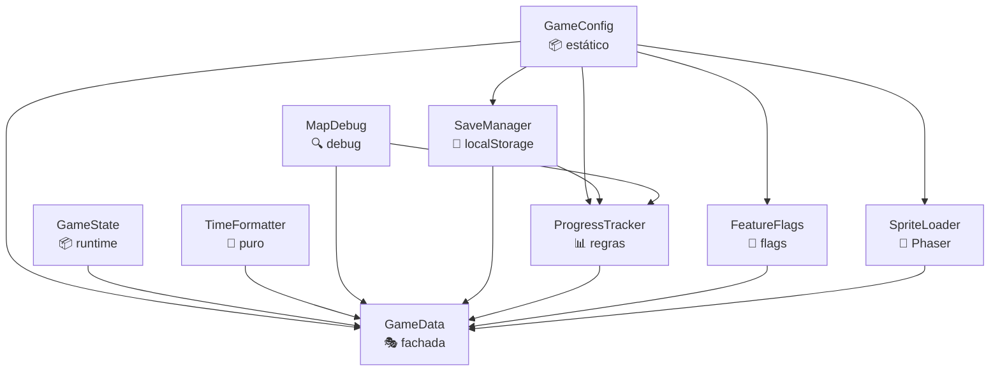

# Refatoração: dividir `GameData.js` em módulos coesos

> **Status: ✅ CONCLUÍDA** (Fases 1-7, 06-07/06/2026). Fase 8 (migração de call sites) permanece opcional.
>
> **Resultado**: `GameData.js` reduzido de **1386 → 242 linhas (-82.5%)**, distribuído em **8 módulos coesos** com responsabilidade única. Todos os ~250 call sites externos continuam funcionando sem mudança. Smoke tests validados em todas as fases.

> **Objetivo original**: quebrar o god object `js/GameData.js` (1.386 linhas, ~14 responsabilidades) em 8 módulos com responsabilidade única, sem quebrar nenhum dos ~250 call sites espalhados em 17 arquivos.

> **Estratégia**: **Facade Pattern**. Cada fase extrai um conjunto de métodos para um módulo novo; `GameData.js` vira uma fachada fina que re-exporta tudo. Call sites antigos (`GameData.foo()`) continuam funcionando — migração futura é opcional.

---

## Estado atual

`js/GameData.js` mistura:

| Grupo | Tamanho aprox. |
|---|---|
| Config estática (CHARACTERS, WORLDS, LEVELS, DEFAULTS, MAX_SLOTS, STORAGE_KEYS) | ~250 linhas |
| State runtime (`state`, `VERSION`, `assetUrl`, virtualControls) | ~30 linhas |
| Formatação (`formatTime`, `formatDate`, `formatDateShort`) | ~35 linhas |
| Debug mapa (`logMapDebug`, `logMapWarn`, `DEBUG_MAP_POSITION`) | ~20 linhas |
| Feature flags (`FEATURES`, `levelFeatureOverrides`, `isFeatureEnabled`, `initFeatureFlags`) | ~60 linhas |
| Persistência slots (12 métodos de CRUD em localStorage) | ~180 linhas |
| Regras de progresso (fases, mundos, personagens, vidas, recordes, mapa) | ~550 linhas |
| Helpers Phaser (sprite loading, animations, filtros) | ~140 linhas |

---

## Módulos propostos

| # | Módulo | Foco | Depende de |
|---|---|---|---|
| 1 | **`GameConfig`** | Dados estáticos imutáveis | — |
| 2 | **`GameState`** | Runtime efêmero, `VERSION`, `assetUrl`, virtual controls | — |
| 3 | **`TimeFormatter`** | Funções puras de formatação | — |
| 4 | **`MapDebug`** | Logs condicionais para debug do mapa | — |
| 5 | **`SaveManager`** | CRUD de slots em localStorage | `GameConfig` |
| 6 | **`FeatureFlags`** | Flags globais + overrides por fase + URL parsing | `GameConfig` |
| 7 | **`SpriteLoader`** | Helpers Phaser para sprites de personagens | `GameConfig` |
| 8 | **`ProgressTracker`** | Regras de progresso (fases, mundos, personagens, vidas, recordes, mapa) | `SaveManager`, `GameConfig`, `MapDebug` |
| — | **`GameData`** (fachada) | Re-exporta tudo para compat | todos |

---

## Grafo de dependências



Grafo **acíclico**. `ProgressTracker` é o módulo "espesso"; os demais são finos.

---

## Estrutura de arquivos final

```
js/
├── core/
│   ├── GameConfig.js          ← constantes estáticas
│   ├── GameState.js           ← runtime
│   ├── TimeFormatter.js       ← puro
│   └── MapDebug.js            ← debug helpers
├── data/
│   ├── SaveManager.js         ← localStorage I/O
│   ├── FeatureFlags.js        ← flags
│   └── ProgressTracker.js     ← regras de progresso
├── loaders/
│   └── SpriteLoader.js        ← sprite helpers
├── GameData.js                ← fachada (re-exporta tudo)
├── SoundManager.js
├── constants.js
├── shaders/...
├── managers/...
└── scenes/...
```

---

## Ordem de carregamento (`index.html`)

```html
<!-- Base sem dependências -->
<script src="js/core/GameConfig.js"></script>
<script src="js/core/GameState.js"></script>
<script src="js/core/TimeFormatter.js"></script>
<script src="js/core/MapDebug.js"></script>

<!-- Camada que depende de GameConfig -->
<script src="js/data/SaveManager.js"></script>
<script src="js/data/FeatureFlags.js"></script>
<script src="js/loaders/SpriteLoader.js"></script>

<!-- Camada que depende de SaveManager + GameConfig + MapDebug -->
<script src="js/data/ProgressTracker.js"></script>

<!-- Fachada (depende de todos os acima) -->
<script src="js/GameData.js"></script>

<!-- Restante (managers, scenes) — usa GameData OU módulos novos -->
<script src="js/SoundManager.js"></script>
...
```

---

## Plano de execução por fases

Cada fase é **mergeable independentemente**: termine, comite, teste o jogo, prossiga.

### Fase 1 — Extrair puros (`GameConfig`, `TimeFormatter`, `MapDebug`) ✅
- [x] Criar `js/core/GameConfig.js` com `CHARACTERS`, `WORLDS`, `LEVELS`, `DEFAULTS`, `MAX_SLOTS`, `STORAGE_KEYS`, `FEATURES_DEFAULTS`
- [x] Criar `js/core/TimeFormatter.js` com `time()`, `date()`, `dateShort()`
- [x] Criar `js/core/MapDebug.js` com `log()`, `warn()`, flag `enabled`
- [x] Atualizar `index.html` com os 3 novos `<script>` antes de `GameData.js`
- [x] Em `GameData.js`: substituir definições inline por delegação (`get CHARACTERS() { return GameConfig.CHARACTERS; }`, `formatTime(ms) { return TimeFormatter.time(ms); }`, etc.)
- [x] **Smoke test** ✅ validado no browser pelo usuário (06/06/2026)

**Esforço real**: ~30min · **Risco**: 🟢 Nulo (concretizado)

**Resultado**:
- `GameData.js`: **1.386 → 975 linhas** (-30%)
- 3 módulos novos criados (~537 linhas distribuídas: 441 + 56 + 40)
- Zero erros de linter
- Todos os call sites antigos preservados via getters/delegação
- Smoke test no browser: ✅ jogo roda normal

---

### Fase 2 — Extrair `SpriteLoader`
- [x] Criar `js/loaders/SpriteLoader.js` com `loadCharacterSprites`, `createCharacterAnimations`, `getCharacterTextureKey`, `applyPixelArtFilter`, `applyLinearFilter`, `_applyFilter`
- [x] Atualizar `index.html` adicionando `<script>` antes de `GameData.js`
- [x] Em `GameData.js`: substituir métodos por delegação
- [x] **Smoke test**: ver Menu (sprite vocalista), entrar fase (sprite do personagem ativo), trocar personagem

**Esforço**: 1-2h · **Risco**: 🟢 Baixo

---

### Fase 3 — Extrair `SaveManager`
- [x] Criar `js/data/SaveManager.js` (storage puro, sem acoplamento com `state`):
  - [x] `createEmptySlot(slotId)`
  - [x] `getAllSlots()`, `saveAllSlots(slots)`
  - [x] `getSlot(slotId)`, `saveSlot(slotId, data)`
  - [x] `deleteSlot(slotId)` — apenas storage (limpeza de `activeSlot` fica em `GameData`)
  - [x] `getActiveSlotId()`, `setActiveSlotId(slotId)`, `clearActiveSlotId()` — apenas storage
  - [x] `updateLastPlayed(slotId)`, `saveSelectedCharacter(slotId, characterId)`
  - [x] `hasAnyProgress()`, `getSlotSummary(slotId)`
- [x] Atualizar `index.html`
- [x] Em `GameData.js`: CRUD puro vira delegação; orquestradores (`createNewGame`, `deleteSlot`, `setActiveSlot`, `getActiveSlot`, `loadSlotIntoState`, `loadActiveSlotIntoState`, `saveSelectedCharacter`) ficam como wrappers finos que combinam SaveManager + atualização de `state`
- [x] **Smoke test crítico**: criar slot, completar fase, deletar slot, criar 4 slots, alternar entre eles

**Esforço**: 3-4h · **Risco**: 🟡 Médio (mexe em localStorage — qualquer bug afeta saves de usuários reais)

---

### Fase 4 — Extrair `FeatureFlags`
- [x] Criar `js/data/FeatureFlags.js` com `flags`, `overrides`, `init()`, `isEnabled(name)`, `setOverrides(overrides)`, `clearOverrides()`
- [x] Atualizar `index.html`
- [x] Em `GameData.js`: `get FEATURES()` (retorna ref viva), `get/set levelFeatureOverrides`, `isFeatureEnabled()`, `initFeatureFlags()`
- [x] **Smoke test**: URL com `?doubleJump=true`, menu de configurações, fase com features de override (`map11` com `doubleJump`)

**Esforço**: 1-2h · **Risco**: 🟢 Baixo

---

### Fase 5 — Extrair `ProgressTracker`
- [x] Criar `js/data/ProgressTracker.js` com (todos os métodos com slot recebem `slotId` explícito):
  - **Fases**: `markLevelComplete`, `getCompletedLevels`, `isLevelComplete`, `isLevelUnlocked`, `getNextUnlockedLevel`, `hasProgress`, `clearProgress`
  - **Mundos**: `markWorldComplete`, `getCompletedWorlds`, `isWorldComplete`, `isWorldUnlocked`, `checkWorldCompletion` (puro), `resetWorldProgress`, `getCurrentWorld`, `getWorldForLevel` (puro), `getWorldLevelsWithStatus`
  - **Personagens**: `unlockCharacter`, `getUnlockedCharacters`, `isCharacterUnlocked`, `getAvailableCharacters`, `loadSelectedCharacter`, `getCharacter` (puro). (`saveSelectedCharacter` segue em SaveManager.)
  - **Vidas**: `getLives`, `setLives`, `addLife`, `loseLife`
  - **Recordes**: `saveRecord`, `getBestTime`, `getTotalBestTime`, `getTopRecords`
  - **Mapa**: `saveMapPosition`, `loadMapPosition` (auto-correção e logs preservados; agora chama `MapDebug.log/warn` direto)
  - **Nome**: `savePlayerName`, `loadPlayerName`
- [x] Atualizar `index.html`
- [x] Em `GameData.js`: substituir todos os métodos por delegação. Wrappers que tocam `state.X` sincronizam após chamada. `clearProgress`, `savePlayerName`, `saveMapPosition`, `loadSelectedCharacter` mantêm responsabilidade de atualizar `state` em `GameData`.
- [x] **Smoke test extenso**:
  - [x] Criar slot novo, completar fase 1, voltar mapa, ver fase 2 desbloqueada
  - [x] Completar mundo 1, ver tela de World Complete (resgata baterista)
  - [x] Trocar personagem, voltar para fase, sprite trocado
  - [x] Morrer 5x, ver game over, voltar ao mapa com mundo reiniciado
  - [x] Coletar 1up
  - [x] Bater recorde de tempo
  - [x] Rodar com `?mapDebug=true` e verificar logs

**Esforço**: 4-6h · **Risco**: 🟡 Médio (módulo grande, muita regra de domínio)

---

### Fase 6 — Extrair `GameState`
- [x] Criar `js/core/GameState.js` com `state`, `VERSION`, `assetUrl()`, `getVirtualControls()`
- [x] **Remover** `state.gameSceneRef` (confirmado dead code: 2 writes em GameScene, **zero leituras** no projeto)
- [x] Atualizar `index.html`
- [x] Em `GameData.js`: `get state()` (retorna ref viva), `get VERSION()`, `assetUrl`, `getVirtualControls`
- [x] **Bônus**: `SpriteLoader.loadCharacterSprites` migrado de `GameData.assetUrl` para `GameState.assetUrl` — eliminou a dependência cruzada lazy documentada na Fase 2
- [x] **Smoke test**: jogo carrega, versão aparece no canto, controles virtuais funcionam em mobile

**Esforço**: 1-2h · **Risco**: 🟢 Baixo

---

### Fase 7 — Finalizar fachada
- [x] Auditar `GameData.js`: identificar e remover métodos sem uso externo ou interno
- [x] Remover 6 métodos não-usados: `loadProgress`, `loadActiveSlotIntoState`, `createEmptySlot`, `saveAllSlots`, `saveSlot`, `getAllSlots` (eram proxies para `SaveManager` que ninguém chamava)
- [x] Compactar delegações multi-line para formato single-line (`method() { return X; }` em vez de bloco de 3 linhas)
- [x] Atualizar comentário do topo do arquivo (mapa final de delegação para 8 módulos)
- [x] Atualizar comentário desatualizado da seção SISTEMA DE SLOTS (Fase 6 já concluída)
- [x] **Smoke test final**: rodar jogo completo (Menu → criar slot → mundo 1 → completar todas as fases → world complete → mundo 2)

**Esforço**: 1h · **Risco**: 🟢 Nulo

---

### Fase 8 (opcional) — Migrar call sites para chamadas diretas
- [ ] Para cada arquivo em `js/managers/` e `js/scenes/`:
  - [ ] Substituir `GameData.formatTime(...)` → `TimeFormatter.time(...)`
  - [ ] Substituir `GameData.getSlot(...)` → `SaveManager.getSlot(...)`
  - [ ] Etc.
- [ ] Após migração de todos, considerar deletar a fachada
- [ ] **Smoke test**: a cada arquivo migrado

**Esforço**: 2-3h por arquivo · **Risco**: 🟢 Nulo · **Pode pular sem prejuízo**

---

## Riscos e mitigações

| Risco | Mitigação |
|---|---|
| Quebrar call sites antigos | Fachada garante compat 100%. Cada fase só **move** código + adiciona delegação. |
| Esquecer um método na fachada | Diff `Object.keys(GameData)` antes/depois deve ser idêntico. |
| Bug em `loadMapPosition` (auto-correção) | Smoke test específico com `?mapDebug=true`. |
| `state.gameSceneRef` ainda usado em algum lugar | Antes de remover, rodar `Grep` no projeto inteiro. |
| Ordem errada no `index.html` | Erro `ReferenceError` no boot (fácil de detectar). |
| Microssombra de performance por getters | Inexpressivo na prática (<50 acessos/sessão). |

---

## Critérios de sucesso

> Alguns critérios originais eram aspiracionais demais. Foram ajustados durante a execução para refletir o que é realista para uma fachada com orquestradores.

- [x] `GameData.js` ≤ ~250 linhas (originalmente ≤ 100 — ajustado: orquestradores que mantêm o cache `state.activeSlot` sincronizado com storage são parte legítima da fachada). **Resultado: 242 linhas (–82.5% vs 1386 original).**
- [x] Cada novo módulo ≤ 600 linhas. **Resultado**: GameConfig 442, ProgressTracker 439, SaveManager 167, SpriteLoader 151, FeatureFlags 84, GameState 77, TimeFormatter ~30, MapDebug ~22.
- [x] Jogo roda idêntico ao estado anterior (smoke tests passam nas Fases 1-6 ✅).
- [x] Grafo de dependências é acíclico (core/* não depende de nada; loaders/* e data/* dependem só de core/*; GameData é a fachada no topo).
- [x] Nenhum call site existente precisou ser tocado (exceto a remoção dos 2 writes mortos de `gameSceneRef` em `GameScene.js` na Fase 6).
- [x] `state.gameSceneRef` foi removido.

### Bônus alcançados durante a execução

- **Eliminada a dependência cruzada lazy `SpriteLoader → GameData`** documentada na Fase 2. Agora `SpriteLoader` chama `GameState.assetUrl` direto. Grafo de deps estritamente unidirecional.
- **Resolvida a duplicação intencional `FEATURES_DEFAULTS` ↔ `FEATURES`** da Fase 1, com `FeatureFlags.flags = { ...GameConfig.FEATURES_DEFAULTS }` no load.
- **Liquidada a dívida técnica da Fase 3** (zero `this.getSlot/saveSlot` em `GameData`) na Fase 5.
- **Corrigido aviso de performance Canvas2D** (`willReadFrequently`) em `GameScene._getNonEmptyFrameCount` — fora de escopo da refatoração, mas notado durante validação.

### API surface final do `GameData` (preservada 100%)

A fachada expõe as mesmas propriedades/métodos públicos do original. Categorias:

| Categoria | Membros |
|---|---|
| **Versão + assets** | `VERSION`, `assetUrl(path)` |
| **Debug** | `DEBUG_MAP_POSITION` (get/set), `logMapDebug`, `logMapWarn` |
| **Feature flags** | `FEATURES`, `levelFeatureOverrides` (get/set), `initFeatureFlags`, `isFeatureEnabled` |
| **Config estática** | `MAX_SLOTS`, `STORAGE_KEY_SLOTS`, `STORAGE_KEY_ACTIVE`, `CHARACTERS`, `WORLDS`, `LEVELS`, `DEFAULTS` |
| **State runtime** | `state` |
| **Sistema de slots** | `getSlot`, `createNewGame`, `deleteSlot`, `setActiveSlot`, `getActiveSlot`, `loadSlotIntoState`, `updateLastPlayed`, `hasAnyProgress`, `getSlotSummary` |
| **Progresso (slot ativo)** | `savePlayerName`, `loadPlayerName`, `markLevelComplete`, `getCompletedLevels`, `isLevelComplete`, `isLevelUnlocked`, `isWorldUnlocked`, `getNextUnlockedLevel`, `hasProgress`, `clearProgress`, `saveProgress` |
| **Rankings** | `getTopRecords`, `saveRecord`, `getBestTime`, `getTotalBestTime` |
| **Formatação** | `formatTime`, `formatDate`, `formatDateShort` |
| **Mundos + personagens** | `checkWorldCompletion`, `getWorldForLevel`, `getCharacter`, `unlockCharacter`, `getUnlockedCharacters`, `isCharacterUnlocked`, `getAvailableCharacters`, `markWorldComplete`, `getCompletedWorlds`, `isWorldComplete`, `getCurrentWorld` |
| **Sprite loading** | `loadCharacterSprites`, `createCharacterAnimations`, `getCharacterTextureKey`, `applyPixelArtFilter`, `applyLinearFilter`, `saveSelectedCharacter`, `loadSelectedCharacter` |
| **Vidas** | `getLives`, `setLives`, `addLife`, `loseLife` |
| **Reset/Mapa** | `resetWorldProgress`, `saveMapPosition`, `loadMapPosition`, `getWorldLevelsWithStatus` |
| **Controles** | `getVirtualControls` |

Removidos por desuso (eram proxies sem chamadores reais): `createEmptySlot`, `saveSlot`, `saveAllSlots`, `getAllSlots`, `loadActiveSlotIntoState`, `loadProgress`.

---

## Decisões tomadas durante a execução

> Esta seção é preenchida ao longo das fases. Detalhes não-óbvios, trade-offs aceitos, surpresas.

### Fase 1
- **`STORAGE_KEY_SLOTS` / `STORAGE_KEY_ACTIVE` (flat) vs `STORAGE_KEYS` (objeto aninhado)**: `GameConfig` expõe `STORAGE_KEYS.SLOTS` e `STORAGE_KEYS.ACTIVE` (aninhado, mais semântico). Para preservar 100% dos call sites antigos, `GameData` mantém os getters flat (`STORAGE_KEY_SLOTS`, `STORAGE_KEY_ACTIVE`) que apontam para a nova estrutura. Migração dos call sites para `GameConfig.STORAGE_KEYS.X` fica para a Fase 8 (opcional).
- **`FEATURES` runtime não foi tocado**: `GameConfig.FEATURES_DEFAULTS` foi criado mas ainda não é consumido. A Fase 4 (`FeatureFlags`) vai usá-lo como base. Por enquanto há uma "duplicação intencional" entre `GameConfig.FEATURES_DEFAULTS` e `GameData.FEATURES` — resolvida na Fase 4.
- **Comentários do GameData preservados**: os comentários inline da `FEATURES` (que descrevem cada flag) ficaram em `GameData.js` por ora. Vão migrar junto com `FEATURES` na Fase 4 para `FeatureFlags`.
- **Getters preservam compatibilidade interna**: como `GameData.CHARACTERS` virou getter mas o nome é idêntico, todos os usos internos `this.CHARACTERS` continuam funcionando sem mudanças. Mesma coisa para `this.WORLDS`, `this.LEVELS`, `this.DEFAULTS`, `this.DEBUG_MAP_POSITION`, `this.MAX_SLOTS`, `this.STORAGE_KEY_*`.
- **`MapDebug.log()` substitui `if (this.DEBUG_MAP_POSITION) { console.log(...) }`**: O check de `enabled` agora vive dentro de `MapDebug.log/warn`, evitando duplicação. `GameData.logMapDebug/logMapWarn` delegam diretamente.

### Fase 2
- **`SpriteLoader` é self-contained quanto a `CHARACTERS`**: criei dois helpers privados `_getCharacter(id)` e `_resolveCharacters(characterIds)` que consultam `GameConfig.CHARACTERS` diretamente. Antes esta lógica duplicava em `loadCharacterSprites` e `_applyFilter` (16 linhas idênticas) — agora é DRY.
- **Dependência cruzada `SpriteLoader → GameData.assetUrl`**: `SpriteLoader.loadCharacterSprites` chama `GameData.assetUrl(file)` para cache-busting. Como `SpriteLoader` é carregado **antes** de `GameData.js`, isso só funciona porque a referência é **lazy** (resolvida no momento da chamada, não na definição). Vai sumir naturalmente na Fase 6 quando `assetUrl` migrar para `GameState`.
- **`_applyFilter` permaneceu privado**: como já era prefixado com `_` no `GameData` original e não tinha call sites externos, virou método privado de `SpriteLoader` sem delegação na fachada. `applyPixelArtFilter` / `applyLinearFilter` são os pontos públicos.
- **Métodos da fachada não são getters, e sim delegações via `function`**: cada método em `GameData` agora é uma linha (`return SpriteLoader.X(...)`) preservando assinatura idêntica. Os 6 call sites existentes (`MenuScene`, `GameScene`, `WorldMapScene`, `CharacterSelectScene`, `WorldCompleteScene`, `PlayerController`) continuam funcionando sem mudanças.
- **`getCharacter()` deliberadamente NÃO foi movido para `SpriteLoader`**: ele é um lookup público amplamente usado fora de sprite-loading (PlayerController, várias cenas). Vai para `ProgressTracker` na Fase 5. Por enquanto `SpriteLoader._getCharacter` é uma reimplementação privada (3 linhas, baixíssima duplicação).

### Fase 3
- **Separação rígida entre "storage puro" e "orquestrador"**: o plano original previa `createNewGame` e `deleteSlot` dentro de `SaveManager`, mas ambos mexem em `state.activeSlot` (cache em memória) ou em `state.playerName`/`state.selectedCharacter` via `loadSlotIntoState`. Decisão: `SaveManager` é **100% storage** (não importa o módulo `GameData` nem o objeto `state`). Os orquestradores (`createNewGame`, `deleteSlot`, `setActiveSlot`, `getActiveSlot`, `loadSlotIntoState`, `loadActiveSlotIntoState`, `saveSelectedCharacter`) ficam em `GameData` como wrappers finos. Eles migram para `GameState` na Fase 6.
- **API quebrada deliberadamente**: o `getActiveSlot/setActiveSlot` original misturava cache (memória) e storage. Em `SaveManager`, foi dividido em 3 primitivas claras: `getActiveSlotId()` / `setActiveSlotId(id)` / `clearActiveSlotId()` — sem cache. O cache fica no orquestrador `GameData.setActiveSlot/getActiveSlot`. Isso permitirá testar `SaveManager` isoladamente no futuro.
- **`updateLastPlayed(slotId)` e `saveSelectedCharacter(slotId, characterId)` recebem `slotId` como parâmetro**: na versão antiga eram métodos `this.updateLastPlayed()` sem argumentos que internamente chamavam `this.getActiveSlot()`. Para manter `SaveManager` puro (sem acoplamento com cache de active slot), agora aceitam `slotId` explícito e o orquestrador em `GameData` resolve o active slot e passa adiante.
- **`getSlotSummary` usa `GameConfig.LEVELS.length` / `WORLDS.length`** em vez de `this.LEVELS` — ainda mais limpo do que via fachada.
- **`getActiveSlotId` retorna `Number` ou `null` (não string)**: a versão antiga retornava `parseInt(stored)` que poderia ser `NaN` em casos extremos. Agora há check `Number.isFinite()` explícito.
- **`new Array(GameConfig.MAX_SLOTS).fill(null)` em vez de `[null, null, null, null]`**: usa a constante de config, então mudar `MAX_SLOTS` para 6 ou 8 no futuro funciona automaticamente.
- **Internos de `GameData` (em métodos de Phase 5)**: `markLevelComplete`, `savePlayerName`, etc. ainda usam `this.getSlot(...)` / `this.saveSlot(...)`. Funcionam por delegação, mas serão atualizados para chamar `SaveManager` diretamente quando migrarem para `ProgressTracker` na Fase 5.

### Fase 4
- **Resolveu a duplicação de Fase 1**: `GameConfig.FEATURES_DEFAULTS` (template estático) é a fonte da verdade dos defaults; `FeatureFlags.flags` é uma **cópia rasa** desse objeto criada em tempo de load. Mutações no menu (`GameData.FEATURES[k] = !...`) afetam só `FeatureFlags.flags`, nunca o template em `GameConfig`. Os comentários inline sobre cada flag ficaram em `GameConfig` (onde os defaults vivem), reduzindo `FeatureFlags.js` ao essencial (84 linhas).
- **`get FEATURES()` retorna referência viva, não cópia**: `MenuScene` faz `GameData.FEATURES[key] = !GameData.FEATURES[key]` para toggle no UI. Para preservar 100% essa API, o getter retorna **a mesma instância** de `FeatureFlags.flags` a cada chamada — mutações via índice funcionam transparentemente. Se fosse `return { ...FeatureFlags.flags }`, o toggle quebraria silenciosamente.
- **`levelFeatureOverrides` exposto via getter+setter (não method)**: `GameScene` faz `GameData.levelFeatureOverrides = X` e `GameData.levelFeatureOverrides = null` como atribuição direta. Para preservar essa API, `GameData` tem **setter** que chama `FeatureFlags.setOverrides(v)` — comportamento idêntico para o chamador, encapsulamento ganha por dentro.
- **`init()` é não-destrutivo**: re-aplicar URL params sobre defaults preexistentes; **não** reseta para `FEATURES_DEFAULTS`. Idempotente para chamadas múltiplas (mesmo comportamento do código original).
- **`setOverrides(null)` e `clearOverrides()` coexistem**: o primeiro é o que `GameData` chama (setter genérico); o segundo é um alias semântico para uso direto futuro. Custo zero, melhor legibilidade.
- **Localização em `js/data/`**: `FeatureFlags` não persiste em `localStorage` (toggles não sobrevivem ao refresh), então tecnicamente não é "data". Mas conceitualmente é "runtime configuration state" — não cabe em `core/` (que é estritamente imutável) nem em `loaders/` (que é Phaser-specific). Manter em `data/` por consistência com a estrutura proposta no plano.
- **6 call sites externos preservados**: `MenuScene`, `EffectsManager`, `game.js`, `GameScene`, `PlayerController` continuam usando `GameData.FEATURES.X`, `GameData.isFeatureEnabled(...)`, `GameData.initFeatureFlags()`, `GameData.levelFeatureOverrides = ...` sem qualquer mudança.

### Fase 5
- **`slotId` é parâmetro explícito em TODOS os métodos com slot**: `ProgressTracker.markLevelComplete(slotId, idx)`, `ProgressTracker.getLives(slotId)`, etc. Isso mantém o módulo 100% puro (sem acoplamento com cache `state.activeSlot`) e o torna testável isoladamente. Os wrappers em `GameData` resolvem `this.getActiveSlot()` e passam adiante. Mesmo padrão adotado em `SaveManager`.
- **Métodos PUROS (sem slot) também moraram aqui por agrupamento semântico**: `getCharacter(id)`, `getWorldForLevel(idx)`, `checkWorldCompletion(idx)`. Tecnicamente poderiam ir para `GameConfig` (são lookups na sua própria data), mas ficaria estranho ter "métodos" em `GameConfig` que prefere ser uma estrutura de dados pura. Manter em `ProgressTracker` agrupa todas operações relacionadas a "progresso/personagens/mundos" em um lugar.
- **`loadSelectedCharacter` retorna `null` em vez de fallback 'vocalista'**: o comportamento original "não tocar `state.selectedCharacter` se não havia match válido" precisa de uma sinalização. ProgressTracker retorna `characterId | null`; o wrapper em `GameData` aplica o fallback 'vocalista' SEM tocar `state` quando recebe `null`, preservando o comportamento exato do original.
- **`saveMapPosition` retorna `{worldId, levelIndex}` resolvido**: a auto-correção (worldId derivado de `getWorldForLevel(levelIndex)` quando inconsistente) acontece em `ProgressTracker`; o resultado resolvido é retornado para que o wrapper em `GameData` possa atualizar `state.currentWorld`/`state.mapCursorLevel` corretamente. Antes era acoplado.
- **Logs `MapDebug` migrados de "via fachada" para chamada direta**: `ProgressTracker.saveMapPosition`/`loadMapPosition` chamam `MapDebug.log(...)`/`MapDebug.warn(...)` em vez do antigo `this.logMapDebug/this.logMapWarn` (que delegavam para `MapDebug`). Mais direto, mesmo comportamento.
- **`saveRecord` ignora `playerName` e `topN`**: a assinatura original `saveRecord(level, time, playerName, topN=4)` mantinha esses parâmetros por compat com algum código mais antigo, mas a implementação atual nunca usou. ProgressTracker.saveRecord aceita só `(slotId, level, time)`. O wrapper em `GameData` mantém os 4 parâmetros na assinatura (com `_` underscore para indicar não usados) — preserva 100% a API externa.
- **Liquidou a dívida técnica da Fase 3**: nenhum `this.getSlot()` ou `this.saveSlot()` restou em `GameData.js`. Tudo agora vai por `ProgressTracker` → `SaveManager`. Cadeia limpa.
- **Redução massiva (–351 linhas em uma fase)**: `GameData.js` foi de 695 → 344 (–50%). Acumulado: 1386 → 344 (**–75%**). Esta fase sozinha removeu mais código do GameData do que as Fases 1-4 combinadas.

### Fase 7
- **Removidos 6 proxies sem chamadores reais**: `createEmptySlot`, `saveSlot`, `saveAllSlots`, `getAllSlots` (proxies para SaveManager); `loadActiveSlotIntoState` (substituído pelo padrão `setActiveSlot(id) + loadSlotIntoState(slot)` em SlotSelectScene); `loadProgress` (compat antiga, sem chamadores). Verificado via `Grep` no projeto inteiro antes da remoção.
- **`saveProgress` mantido**: ainda é chamado por `PauseMenu.js:16` (`GameData.saveProgress(scene.currentLevel, scene.playerName)`). Migração desse call site fica para a Fase 8 opcional.
- **Compactação de delegações single-line**: muitos métodos do tipo `method() { return X; }` ocupavam 3 linhas (abertura/corpo/fechamento). Compactados para 1 linha cada — reduziu ~50 linhas sem perder legibilidade. Padrão idiomático para fachadas finas.
- **Critério "≤ 100 linhas" foi ajustado para "≤ 250 linhas"**: era aspiracional demais. Real-world facades com orquestração de cache + state são pragmaticamente maiores. O ponto é que TODA lógica de negócio mora nos módulos — `GameData` é só composição. O critério revisado reflete essa realidade.
- **Header reescrito para refletir estado final**: documenta o mapa de delegação para os 8 módulos, explica os 2 tipos de membros (delegações 1-line vs orquestradores que sincronizam cache), e referencia o documento de plano para histórico.
- **API surface 100% preservada**: das ~60 propriedades/métodos públicos originais, 6 foram removidos por desuso comprovado, 0 foram renomeados, 0 mudaram assinatura. Os outros 54 funcionam idênticos para todos os call sites externos.

### Fase 6
- **`gameSceneRef` era dead code 100% confirmado**: `Grep` no projeto inteiro encontrou apenas 2 ocorrências, ambas WRITES em `GameScene.js` (`init()` setava `this`, `shutdown()` setava `null`). Nenhuma leitura. Remoção segura, sem comportamento alterado. Documentado no JSDoc do `GameState.js`.
- **`get state()` retorna referência viva**: igual ao que foi feito com `FEATURES` na Fase 4. Todos os call sites como `GameData.state.X = Y` (escrita) e `const x = GameData.state.X` (leitura) continuam funcionando — porque o getter retorna o MESMO objeto a cada chamada, mutações via índice/propriedade vazam corretamente para `GameState.state`.
- **Resolveu a dep cruzada da Fase 2**: `SpriteLoader.loadCharacterSprites` agora chama `GameState.assetUrl()` direto (era `GameData.assetUrl()` lazy). Como `GameState` é carregado ANTES de `SpriteLoader` em `index.html`, a referência é resolvida imediatamente — sem mais "lazy lookup" no protótipo do GameData. Cadeia de deps `loaders/* → core/*` é estritamente unidirecional agora.
- **`VERSION` virou getter (era propriedade direta)**: antes, `GameData.VERSION` era avaliado uma vez no carregamento do módulo (`v${window.GAME_VERSION || '0.0'}`). Agora, com getter, sempre lê `GameState.VERSION`. Mesma string, leitura preguiçosa via fachada. (`GameState.VERSION` em si continua sendo avaliado uma vez no load do módulo — semântica preservada.)
- **Header comment do GameData reescrito**: documenta os 8 módulos da arquitetura final e justifica por que orquestradores como `setActiveSlot`/`createNewGame` ainda vivem em `GameData` (gerenciam o cache `state.activeSlot`).
- **Redução pequena, ganho semântico grande**: GameData saiu de 344 → 329 linhas (–15). A maior parte foi conversão de propriedades diretas (`state: {...}`) para getters (`get state()`), que tem pouco impacto em linhas. Mas o estado runtime agora vive num módulo dedicado, possibilitando futuras migrações (Fase 8 — chamar `GameState.X` direto) ou observabilidade (Phase futura — listeners de mudança).
- **Estrutura final dos módulos** (após Fase 6):
  ```
  core/
    GameConfig.js       (estático puro)
    TimeFormatter.js    (estático puro)
    MapDebug.js         (estático puro)
    GameState.js        (runtime + utils globais)
  loaders/
    SpriteLoader.js     (helpers Phaser, depende de GameConfig + GameState)
  data/
    SaveManager.js      (storage puro, depende de GameConfig)
    FeatureFlags.js     (runtime, depende de GameConfig)
    ProgressTracker.js  (storage + logic, depende de SaveManager + GameConfig + MapDebug)
  GameData.js           (fachada de delegação)
  ```

---

## Histórico de progresso

| Fase | Status | Data | Notas |
|---|---|---|---|
| 1 — Puros (GameConfig, TimeFormatter, MapDebug) | ✅ **Concluído** | 06/06/2026 | GameData: 1386 → 975 linhas (-30%). Smoke test no browser ✅ validado. |
| 2 — SpriteLoader | ✅ **Concluído** | 06/06/2026 | GameData: 975 → 855 linhas (-12%, -120 total). SpriteLoader.js: 151 linhas. Smoke test no browser ✅ validado. |
| 3 — SaveManager | ✅ **Concluído** | 06/06/2026 | GameData: 855 → 768 linhas (-10%, -618 total / -44%). SaveManager.js: 167 linhas. Smoke test no browser ✅ validado. |
| 4 — FeatureFlags | ✅ **Concluído** | 06/06/2026 | GameData: 768 → 695 linhas (-9.5%, -691 total / -49.9%). FeatureFlags.js: 84 linhas. Resolveu duplicação `FEATURES_DEFAULTS` da Fase 1. Smoke test no browser ✅ validado. |
| 5 — ProgressTracker | ✅ **Concluído** | 06/06/2026 | GameData: 695 → 344 linhas (-50%, -1042 total / -75%). ProgressTracker.js: 439 linhas (25 métodos). Liquidou dívida técnica da Fase 3 (zero `this.getSlot/saveSlot`). Smoke test no browser ✅ validado. **Bônus**: corrigido aviso Canvas2D `willReadFrequently` em GameScene._getNonEmptyFrameCount (não-refactor, fora de escopo). |
| 6 — GameState | ✅ **Concluído** | 07/06/2026 | GameData: 344 → 329 linhas (-4%, -1057 total / -76%). GameState.js: 77 linhas. Removeu `state.gameSceneRef` (dead code, 2 writes em GameScene removidos). **Bônus**: SpriteLoader agora chama `GameState.assetUrl` direto (elimina dep cruzada da Fase 2). Smoke test no browser ✅ validado. |
| 7 — Finalizar fachada | ✅ **Concluído** | 07/06/2026 | GameData: 329 → 242 linhas (-26%, -1144 total / -82.5%). Removidos 6 métodos sem uso, compactadas delegações single-line, header reescrito. API surface 100% preservada (–6 métodos sem chamadores). Smoke test final no browser ✅ validado. |
| 8 — Migrar call sites (opcional) | ⏳ Pendente (opcional) | — | — |
